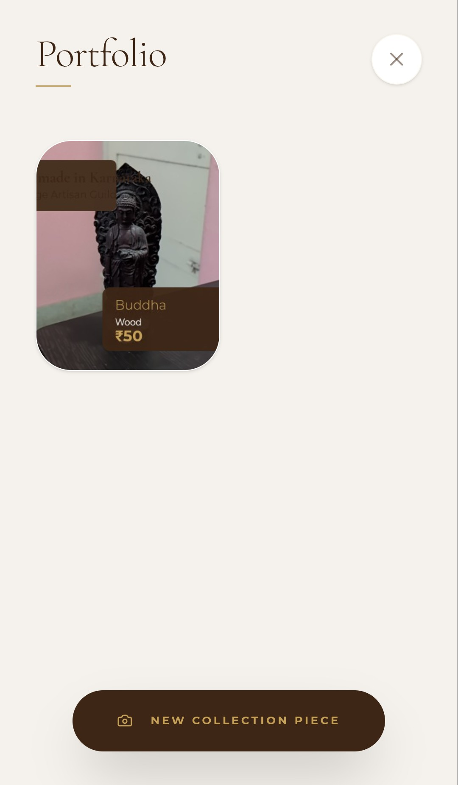
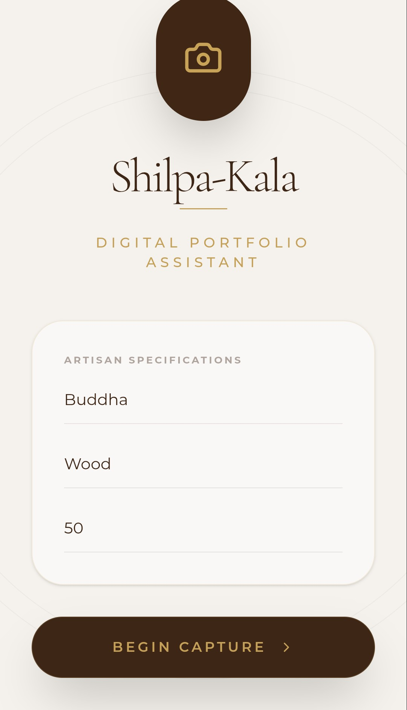

## Run Locally

**Prerequisites:**  Node.js

1. Install dependencies:
   `npm install`
2. Set the `GEMINI_API_KEY` in [.env.local](.env.local) to your Gemini API key
3. Run the app:
   `npm run dev`
   
## Screenshots
[[][]]

## Tech Stack
- Kotlin + Jetpack Compose
- CameraX 1.3.1
- Android SDK 34 (min SDK 24)
- Coil for image loading
- Navigation Compose

## Installation & Run
1. Clone the repo: `git clone <your-repo-url>`
2. Open in Android Studio Hedgehog or newer
3. Let Gradle sync complete
4. Connect an Android device (API 24+) or start an emulator
5. Click Run ▶ (Shift+F10)

## Permissions Required
- CAMERA
- READ_MEDIA_IMAGES (Android 13+)
- WRITE_EXTERNAL_STORAGE (Android < 9)
